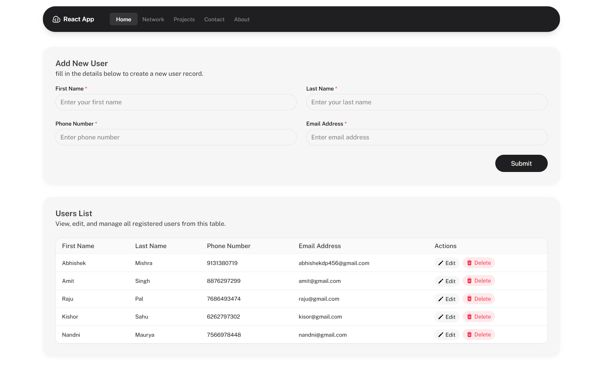

## 📸 Preview


## 🚀 User Management System (Schema-Driven)
A React + TypeScript CRUD application built using a Schema-Driven UI architecture where both the Form and Table are generated from a single configuration file.

This approach ensures that adding new fields requires **minimal code changes** while keeping the UI automatically in sync.

**🔗 Live Demo**: [https://react-crud-task-two.vercel.app/](https://react-crud-task-olive.vercel.app/)

## 🧠 The Core Innovation: Schema-Driven UI
Unlike traditional CRUD apps where inputs and table cells are manually coded, this project uses a **Single Source of Truth**.

### What this means:
- Add a new field in one file → Form updates automatically.
- Same field appears in Table automatically.
- No changes required in form component or table component
  
This directly addresses the extensibility requirement of the assignment.

## 🏗️ Tech Stack
- **Frontend**: React (Vite) + TypeScript
- **State & Forms**: React Hook Form
- **Styling**: Tailwind CSS
- **API**: Axios + JSON Server (Mock API)
- **Feedback**: React Hot Toast + Skeleton Loading + Button Spinner

## 📁 Project Structure
```
src/
 ├─ api/              → Axios instances and endpoints
 ├─ components/
 │    ├─ common/      → UI Kit: Spinner, Popups, Skeleton
 │    ├─ user/        → Feature: UserForm, UserTable
 │    ├─ form-utilities/→ Feature: Custom Input
 ├─ helper/            → UseUsers (Logic & CRUD operations)
 ├─ schema/           → user-form-schema.ts (THE BRAIN)
 └─ types/            → TypeScript interfaces
```

## ➕ How to add a field in 10 seconds
- Navigate to src/schema/user-form-schema.ts and add:
```
{
  name: "phone_number",
  label: "Phone Number",
  type: "tel",
  required: true
}
```
- No other files need to be changed. 
- The validation, the input UI, and the table column will render automatically.

## ✨ Key Features
- Full CRUD: Create, Read, Update, Delete.
-  Context-Aware Editing: Inline adding, Modal-based editing.
- Advanced UI: Loading skeletons, button spinners, and toast notifications.
- Logic Separation: UI components are "dumb"; logic lives in custom hooks.

## ▶️ Run both frontend and mock API together (recommended)
This project uses **JSON Server** as a mock backend and Vite for the frontend.
You can run both with a single command:
```
npm install
npm start
```
This will start:
- Vite app
- JSON server at http://localhost:5000/users

## 📌 Design Decisions
- Single dashboard layout for simplicity.
- Schema as the single source of truth.
- Custom hook (UseUsers) for clean logic separation.
- Reusable UI components for scalability

## 🙌 Author
Abhishek Mishra
